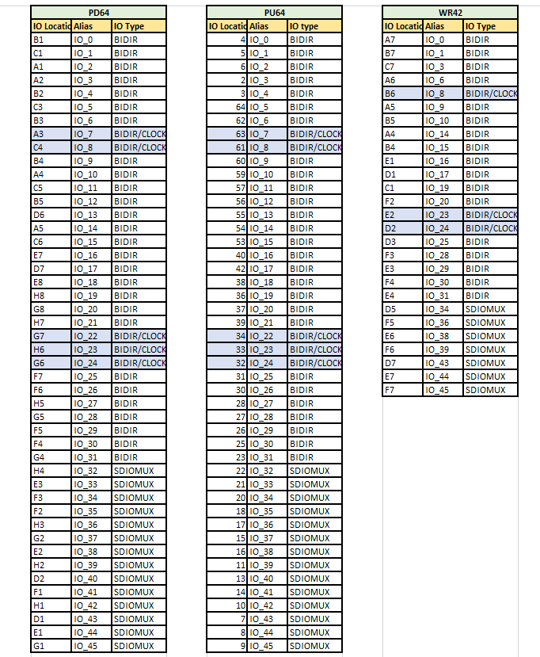

.. index::
   single: Generate the ASCII header file format 

Generate the ASCII header file format 
======================================

  Ascii header file can be generated from the jlink or the .bit file.

    

   Syntax:

    .. code-block:: shell

        ql_symbiflow -compile -src <source complete path> -d <device> -t <top module name> -v <verilog files> -p <pcf file> -P <Package file> -s <SDC file> -dump header

   The output files dumped will be :
    |br| <TOP>_jlink.h - *file generated from the jlink input*
    |br| <TOP>_bit.h - *file generated from the bit file input*
    |br| 

    .. code-block:: shell

        ql_symbiflow -compile -src $PWD -d ql-eos-s3 -t top -v counter_16bit.v -p counter_16bit.pcf -P PD64 -s counter_16bit.sdc  -dump header

    

   The generated header file can be used in M4 application program to load FPGA
    |br| 

   The output files can be dumped for all as: 

    .. code-block:: shell

        ql_symbiflow -compile -src $PWD -d ql-eos-s3 -t top -v counter_16bit.v -p counter_16bit.pcf -P PD64 -s counter_16bit.sdc  -dump header jlink post_verilog

   PCF: Sample

    

     For package PD64, the counter_16bit has the below IO placements:
    |br| Syntax: set_io <port_name> <Package IO>

    .. code-block:: shell

        set_io clk A3
        set_io enable C1
        set_io reset A1
        set_io count(0) A2
        set_io count(1) B2
        set_io count(2) C3
        set_io count(3) B3
        set_io count(4) B1
        set_io count(5) C4
        set_io count(6) B4
        set_io count(7) A4
        set_io count(8) C5
        set_io count(9) B5
        set_io count(10) D6
        set_io count(11) A5
        set_io count(12) C6
        set_io count(13) E7
        set_io count(14) D7
        set_io count(15) E8

   PCF reference file for various the below packages

   The highlighted pins are the clock ports and can also be used as BIDIR IO. Either IO Location or Alias name can be used.

.. |BR| raw:: html

    

