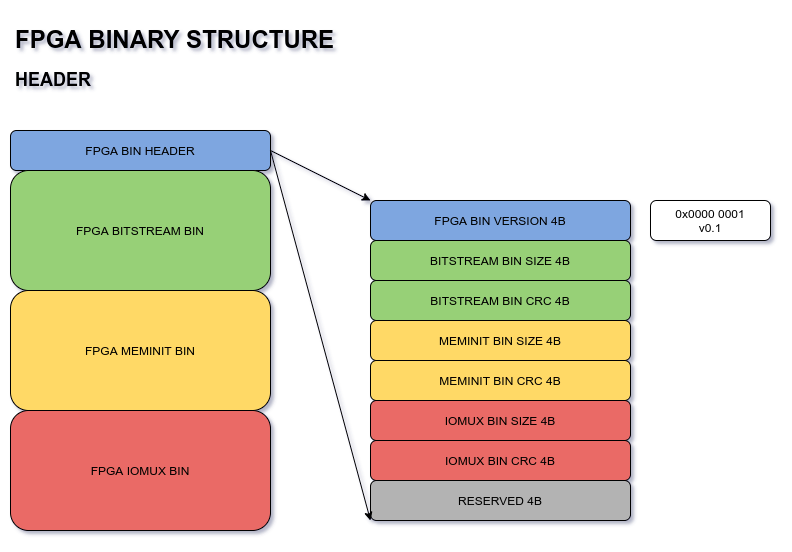
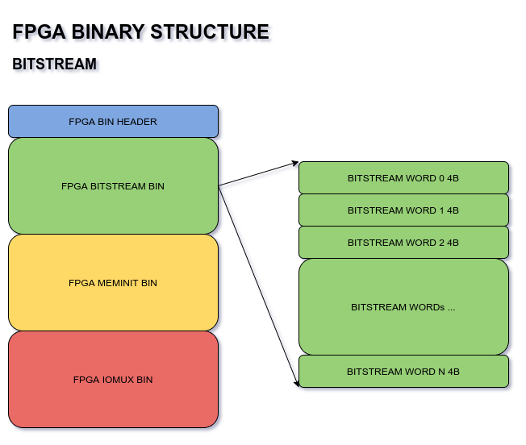
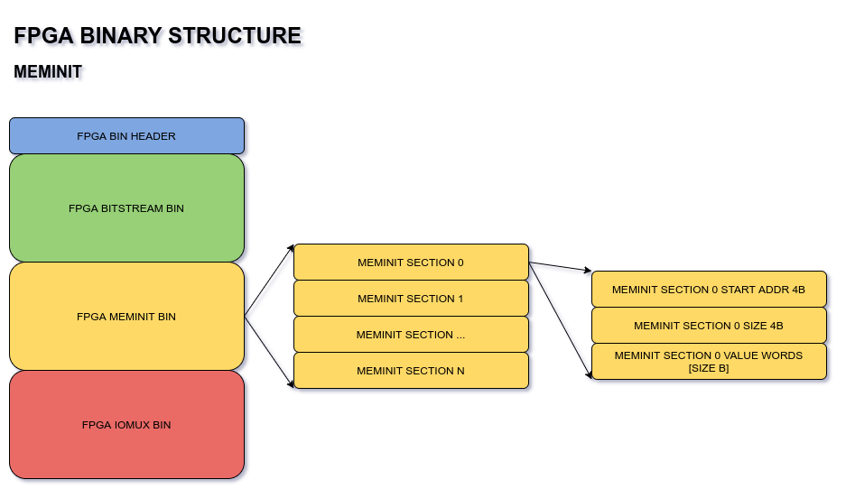
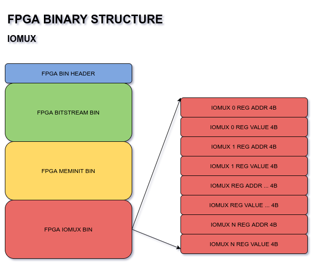

.. index::
   single: Generate the Binary file format 

Generate the Binary File format 
======================================

FPGA Binary file can be generated, which will contain the following components:

1. FPGA Bitstream
2. FPGA MemInit (RAM Block Initialization)
3. FPGA IOMux Configuration

Then, FPGA bin [${TOP}.bin] == bitstream bin + meminit bin + iomux bin

We will need a header in the FPGA bin which indicates the component information (sizes).

The diagrams below show a complete picture of the FPGA bin structure.

FPGA bin header
~~~~~~~~~~~~~~~

The header contains the fields:

- FPGA BIN VERSION - which will help handle future changes in bin structure if needed. Currently at v0.1.
- BITSTREAM BIN SIZE, CRC - size in bytes, and crc of the bitstream binary content
- MEMINIT BIN SIZE, CRC - size in bytes, and crc of the meminit binary content
- IOMUX BIN SIZE, CRC - size in bytes, and crc of the iomux binary content
- RESERVED WORD - for future usage

FPGA bitstream bin
~~~~~~~~~~~~~~~~~~

The bitstream bin will have 4B words, exactly as is currently generated in ${TOP}.bit

FPGA meminit bin
~~~~~~~~~~~~~~~~

The meminit bin will have the same structure as is currently generated in the header method.

For each RAM block, we will have:

- RAM block start address 4B
- RAM block size 4B
- size B of initialization values

This set will be repeated for as many RAM blocks intialized in the design.

FPGA iomux bin
~~~~~~~~~~~~~~

The iomux bin will have a set of pad configurations, each pad configuration is:

- 4B Reg Address
- 4B Reg Value

The number of pad configurations would be equal to the number of pads used by the FPGA design.

Syntax:

.. code-block:: shell

    ql_symbiflow -compile -src <source complete path> -d <device> -t <top module name> -v <verilog files> -p <pcf file> -P <Package file> -s <SDC file> -dump binary

The output files dumped will be :

<TOP>.bin - *file generated from the bit file input*

.. code-block:: shell

    ql_symbiflow -compile -src $PWD -d ql-eos-s3 -t top -v counter_16bit.v -p chandalar.pcf -P PD64 -s counter_16bit.sdc -dump binary

The generated binary file can then be flashed into the board with the programmer, and the bootloader can automatically can load the FPGA design.
