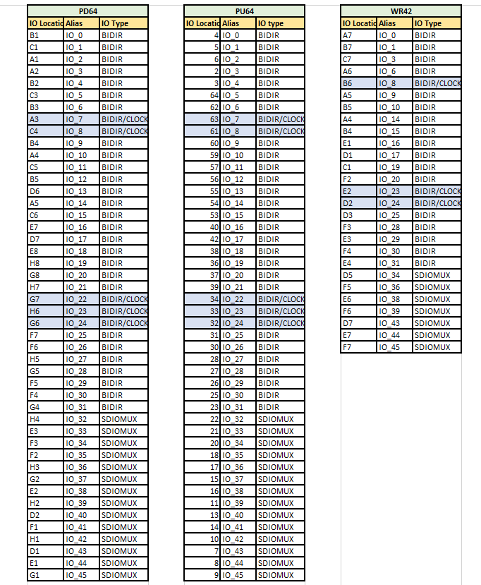

.. index::
   single: PCF sample 

PCF Sample 
==========
  
 The PCF file is for fix placing the IO to a particular IO location on the device. For S3B device we have 3 packages PD64, PU64 and WR42. 

    For package PD64, the counter_16bit has the below IO placements:
    |br| Syntax: set_io <port_name> <Package IO>

    .. code-block:: shell

        set_io clk A3
        set_io enable C1
        set_io reset A1
        set_io count(0) A2
        set_io count(1) B2
        set_io count(2) C3
        set_io count(3) B3
        set_io count(4) B1
        set_io count(5) C4
        set_io count(6) B4
        set_io count(7) A4
        set_io count(8) C5
        set_io count(9) B5
        set_io count(10) D6
        set_io count(11) A5
        set_io count(12) C6
        set_io count(13) E7
        set_io count(14) D7
        set_io count(15) E8

   PCF reference file for various the below packages

   The highlighted pins are the clock ports and can also be used as BIDIR IO. Either IO Location or Alias name can be used.

.. |BR| raw:: html

    

