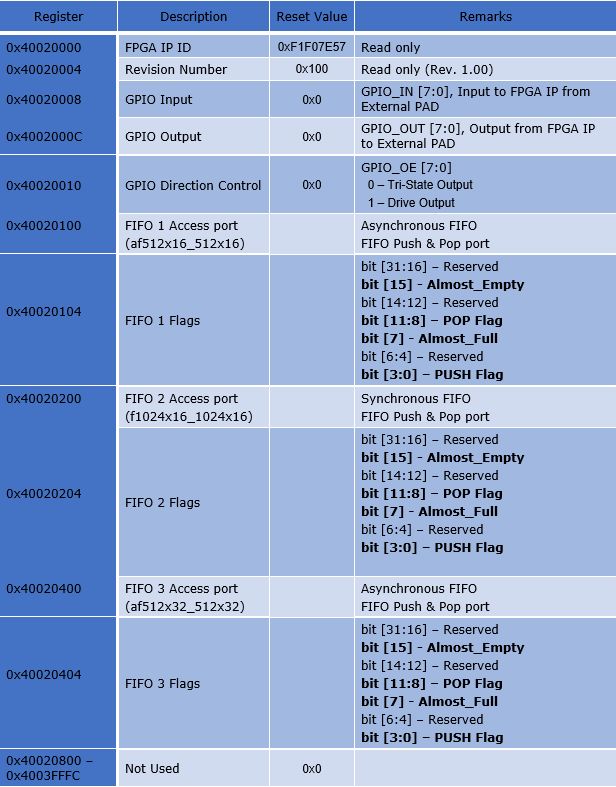

.. index::
   single: Design example Using FIFOs:

Design example Using FIFOs
==========================

The Design example using S3 FIFO block are present at:
|br| *<Install_Path>*/quicklogic-arch-defs/tests/fifo_test

Address Map:

Push Flag Description:

+------------------+-----------------------------------------------+
|**Value**  |U13b| |**Status** |U13b|                              |
+==================+===============================================+
|0000 |U13b|       |Full |U13b|                                    |
+------------------+-----------------------------------------------+
|0001 |U13b|       |Empty |U13b|                                   |
+------------------+-----------------------------------------------+
|0010 |U13b|       |Room for more than one-half |U13b|             |
+------------------+-----------------------------------------------+
|0011 |U13b|       |Room for more than one-fourth |U13b|           |
+------------------+-----------------------------------------------+
|0100 |U13b|       |Room for less than one-fourth full to 64 |U13b||
+------------------+-----------------------------------------------+
|1010 |U13b|       |Room for 32 to 63 |U13b|                       |
+------------------+-----------------------------------------------+
|1011 |U13b|       |Room for 16 to 31 |U13b|                       |
+------------------+-----------------------------------------------+
|1100 |U13b|       |Room for 8 to 15 |U13b|                        |
+------------------+-----------------------------------------------+
|1101 |U13b|       |Room for 4 to 7 |U13b|                         |
+------------------+-----------------------------------------------+
|1110 |U13b|       |Room for at least 2 |U13b|                     |
+------------------+-----------------------------------------------+
|1111 |U13b|       |Room for at least 1 |U13b|                     |
+------------------+-----------------------------------------------+
|Others |U13b|     |Reserved |U13b|                                |
+------------------+-----------------------------------------------+

Pop Flag Description:

+------------------+--------------------------------------+
|**Value**  |U13b| |**Status** |U13b|                     |
+==================+======================================+
|0000 |U13b|       |Empty  |U13r|                         |
+------------------+--------------------------------------+
|0001 |U13b|       |1 entry in FIFO |U13b|                |
+------------------+--------------------------------------+
|0010 |U13b|       |At least 2 entries in FIFO |U13b|     |
+------------------+--------------------------------------+
|0011 |U13b|       |At least 4 entries in FIFO |U13b|     |
+------------------+--------------------------------------+
|0100 |U13b|       |At least 8 entries in FIFO |U13b|     |
+------------------+--------------------------------------+
|0101 |U13b|       |At least 16 entries in FIFO |U13b|    |
+------------------+--------------------------------------+
|0110 |U13b|       |At least 32 entries in FIFO |U13b|    |
+------------------+--------------------------------------+
|1000 |U13b|       |Less than one-fourth to 64 full |U13b||
+------------------+--------------------------------------+
|1101 |U13b|       |One-fourth or more full |U13b|        |
+------------------+--------------------------------------+
|1110 |U13b|       |One-half or more full |U13b|          |
+------------------+--------------------------------------+
|1111 |U13b|       |Full |U13b|                           |
+------------------+--------------------------------------+
|Others |U13b|     |Reserved |U13b|                       |
+------------------+--------------------------------------+

.. |BR| raw:: html

    

.. |U13b| unicode:: U+0000D
   :trim:
.. |U13r| unicode:: U+0000D
   :rtrim:
