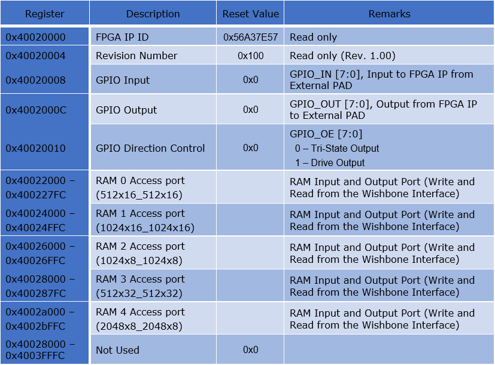

.. index::
   single: Design example Using SRAMs:

Design example Using SRAMs
==========================

The Design example using S3 SRAM block are present at:
|br| *<Install_Path>*/quicklogic-arch-defs/tests/ram_test

Address Map:

RAM Initialization files are at:
|br| *<Install_Path>*/quicklogic-arch-defs/tests/ram_test
|br| Ex. init_2048x8.hex, init_512x32.hex, init_1024x8.hex

.. |BR| raw:: html

    
