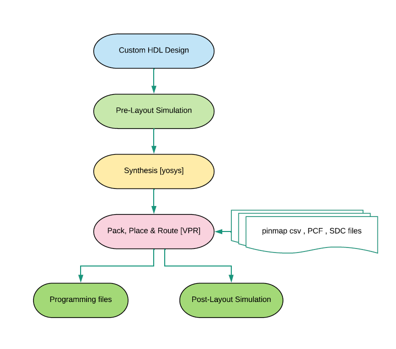

.. index::
   single: Symbiflow: Design flow (qlf_k4n8/qlf_k6n10)

.. _Hlk510519686:

Symbiflow: Design flow (QLF-K4N8/QLF-K6N10)
===========================================

  
   Symbiflow design flow starts with the verilog as input, synthesis done using the yosys, pack, place and route with VPR tool.
   Finally the programming files are dumped which can be used for the fpga programming. Post layout verilog files can be used to validate the verilog design netlist dumped after the place and route.

                

.. |BR| raw:: html

    

